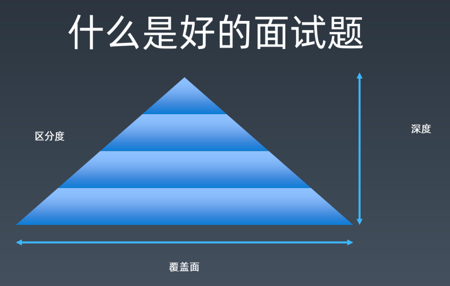

# 番外：面试官怎么想？

## 1、Q&A

### 1.1、整理法的实践中，是否包含对知识的追溯，而追溯的过程和结果是否也是整理的过程？

整理和追溯，winter认为这是建立知识体系的两个方法，而我们在建立知识体系的过程中，这俩方法都得要用，所以这二者肯定是要**结合起来用**的，不管是重学前端还是这次的前端进阶训练营里边所有的跟知识相关的东西，其实都是来自于这两个方法，没有第三个方法了 -> 这是winter学习前端的方法论

> 你中有我，我中有你

## 2、为啥要讲「面试官怎么想」呢？

其实是因为我们要去理解面试这件事情，winter觉得很多同学不理解面试这件事情，既然不理解，那么**你就不能很好地去面试了，甚至你没有很好地办法去学习** -> 所以「这必须得讲哈！」

> 我也不理解面试这件事……

## 3、什么是好的面试题？

一个好的面试题，winter认为有三要素，如果你平时承担面试任务的话，那么这三要素你可以好好研究一下

总之，这个话题既是给面试官听的，也是给我们听的……

好的面试题，有三要素：

- 区分度
- 覆盖面
- 深度

**1）区分度**

啥意思？

> 如果我问一个题，如某些算法题，如大草原算法题 -> 所有人都不会，再如「1+……+100的for循环」 -> 所有人都会 -> 而这种就不是好的面试题了。好的面试题要有区分度 ，好的人能答上来，不好的人能答上来，但这样还不够，要中等好的人，答得中等好，比较好的人，答得比较好，特别好的人，答得特别好，那么这个就叫做区分度了……

简单来说，这题有这样的能力，可以根据他人的回答的情况，可以区分出这些人的前端水平都是怎样的，不过，我个疑问，假如这人是因为背熟了面试题才回答那么好的呢？那该怎么区分呢？

**2）覆盖面**

什么叫覆盖面？

> 我一问这个题，都会激活你所有的前端知识，如「你想写一本前端的书，那么你的目录是什么样的？」 -> 这样就一下全覆盖到了 -> 这题难度特别高，不考虑区分度，大部分人答得都不好，在p6这个档次，winter还没有见过几个答得特别好的同学，但在网上答得还行，而这意味着这区分度不是特别好

**3）深度**

> 这题到底是从哪个难度到哪个难度，如有些题是为了简单区准备的，而有些题则是超高难度的，为高级的候选人准备的，所有这会有个深度范围的问题……

---

总之，以上这三个因素决定了一个面试题到底好不好

有些时候，你去一些比较差的公司，就会遇到这种不太好的面试官，如他们从网上搜题 -> 网上火的面试题，winter从来不用 -> 因为这些题**以「偏难怪」为荣**，还有一些同学因为自己没有面过试也没有参加实际的招聘工作，就会想出一些特别特比难的面试题，有些winter也答不上来……再如网上有些题把Promise、await、setTimeout等混得特别的乱，这种题就很难搞了，虽然细心一点就可以搞出来了，但这种问题问出来区分度是很差的……因为大家很难答对你这个问题……

当然，有些面试官特别有经验，他们可以从一些区分度低的问题里边，通过**追问、提示**等这些方法，即通过**面试官个人能力的补充**，把差的问题变成好的问题……

如winter有一个同事，总是问一些特别可怕的问题，特别边边角角的问题，有一次winter与这同事一同面试一位候选人，而这同事就问了一个特比可怕的问题，这一问，winter就着急了……但是之后没想到，这同事慢慢地通过一步步的提示、追问，最后都能让这个候选人答上来，至此，面试官还是可以通过这道题来**考察到候选人的水平**……但每次都把候选人吓得不行……

这同事在知乎live上大致分享过这样一个意思 -> 精华不在面试题本身，毕竟这面试题本身真得贼鸡儿差，但是通过自己的一步步分解，可以让候选人**有思路有启发** -> 而这就是所谓的**不同面试官有不同风格**……

说了那么多，winter其实想告诉大家：

- 大家不要特比纠结，有的时候你去面试一个公司，面完了，很痛苦，一直在想「为啥这题我就不会呢？一点都答不上来呢？」 -> 但其实问题不大，多面几家公司就好了，当然，如果你面10家，全都答不上来，那才说明自己有问题了 -> 总之，**多面几家心里就舒服了**……

## 4、面试过程中，经常会发生的那几件事？

> 1:17:42

