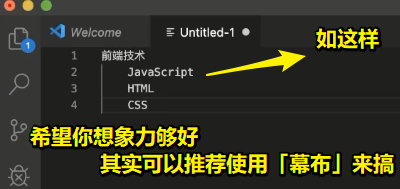
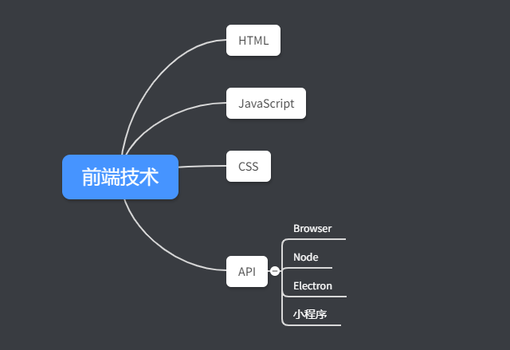
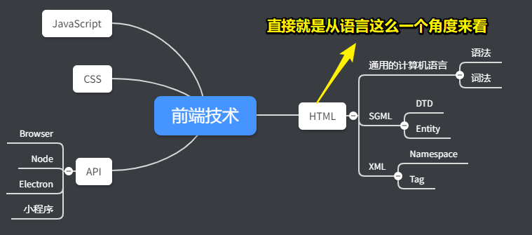

# 02-重学-构建知识体系

## 1、这节课讲什么？

- 实践 -> 如何建立知识体系
- 把上节课的预习作业给写了 -> 为啥要写上节课的预习作业？ -> 预习作业的目的：先让大家在这上边有一定的**探索和思考** -> 对比winter在课上完成的脑图，思考为啥会有差别……
- 这节课会产出一份脑图 -> 之后的每节课都会以这种**产出明确东西**的方式来学习，除此之外，尽量减少课后作业，能在课堂上完成的尽量在课堂上完成，如课上写代码，总结等各种各样的任务 -> 纯用手机看等于课程白上，推荐在电脑端上看，跟着winter一起**互动**…… -> 目前课程的安排和强度，winter认为课后还得要做一些工作

## 2、课前准备？

**1）下载ECMAScript，即JS标准**

[Welcome to Ecma International](https://www.ecma-international.org/default.htm) -> 点一下「standards」这个nav -> 选择「ECMA-262」这个标准：

> [Standard ECMA-262](https://www.ecma-international.org/publications/standards/Ecma-262.htm)

> pdf版 -> 方便随时查阅，毕竟winter这次训练营会经常查阅这个ECMA-262标准

小知识：

> ecma-international.org -> I18N 是 InternationalizatioN (国际化) 的缩写，第一个字 `I` 与最後一个字 `N` 之间有 `18` 个字母

恭喜玩家获得一个「标准在哪儿」的知识

除此之外，它还有个github版的 -> 是该标准最新的draft，特点「很新」：

[ECMAScript® 2021 Language Specification](https://tc39.es/ecma262/)

目前最稳定的版本是5.1版和3.0版的，由于3.0版太老了，推荐使用5.1版的

10版的和5.1版的页数比较：**764页 vs 258页**

如果对新特性没有特别的追求，那么推荐大家先看**5.1版**的，毕竟最新版的内容贼鸡儿多，容易在里边迷失掉

**2）除了看标准以外，还推荐几个比较值得信赖的网站**

- [Web technology for developers - MDN](https://developer.mozilla.org/en-US/docs/Web)
- [Web Hypertext Application Technology Working Group (WHATWG)](https://whatwg.org/)
- [All Standards and Drafts - W3C](https://www.w3.org/TR/)

## 3、标准、文档都是英文的？

你会发现，现在**好一点的资料基本上都是英文的**，所以「你不想看英文」是没有办法可以解决的，不过，好消息的是，你能否看得懂这些标准、文档，跟你的英文水平不是特别的有关系

为啥这样说呢？

你把这些标准给到一个英文水平很好的人，你会发现ta也看不懂

总之，不要有啥心理压力的，看多了自然就懂了，不存在外语好坏之分（不要因英文水平低就自卑），只存在你在这上面**花了多少时间**

> 这「写」 -> 这「些」

## 4、画脑图？

工具 -> xmind -> 不会用到很多很深入的功能，随便用用即可

如果你不用软件，当然，也可以用白板、本子等 -> 手画

如果以上都没有，那么可以打开你的VSCode，新建一个文件，用缩进来代替脑图 -> 想象力比较好用这种形式也是没有问题的

> 不是说你非得要用啥工具，而是你的思维要体现在这图上

第0期的脑图：没有 -> 得找老师要……

> 理想状态下，我们产出的脑图与winter产出的有细微的差别

第1期脑图要点：

**1）树根：「前端技术」**

**2）树干：**

- JS它本身只包含语言，不包含API
- API -> 大块分 -> 包含几个不同的环境（属于一个特定的开发环境，体系独立，不管是谁来定义和设计的，这都是属于完全互相割裂的开发生态） -> 前端不需要掌握所有
  - 最典型的Browser环境
  - Node
  - Electron
  - 小程序

**3）HTML：**

HTML的划分用分维度的姿势来划分，如语言维度，HTML肯定是个语言，但是我们直觉上看，它跟JS这样语言有本质上的（再次强调，本质上的意思就是说词的定义）区别 -> 我们不叫HTML为编程语言，而是计算机语言

- HTML从语言的角度来看，它继承了三方面的内容
  - 通用计算机语言
    - 编译原理 -> 有语法和词法 -> 这俩点很关键
  - [SGML](https://en.wikipedia.org/wiki/Standard_Generalized_Markup_Language#History) ->  起源于 IBM 在1960s 诞生的 GML （通用标记语言） -> 不需要学它 -> 研究一下SGML给HTML带来了什么样的特点 -> 对HTML的影响有：
    - DTD
    - Entity
  - XML -> 对HTML的影响有：
    - Namespace
    - Tag

> 直接就是从语言角度来看了

**语法：**

在哪儿看HTML的语法？

> [HTML Standard](https://html.spec.whatwg.org/multipage/#toc-syntax)

这资料特别的神奇，不仅仅是讲语言语法，还把实现都给讲了，不过，这是让人很难受的，正常来说，应该还有一份词法定义

HTML的词法分析 -> Tokenization是做词法分析的这么一个过程 -> 像是伪代码

有多少种词？ -> 搜索 `Emit `（有个空格） -> 找到token类型

了解以上知识的目的：知道语法和词法到底是个什么东西

如果不学它们，就会在HTML里边产生一些问题

如人家问你：HTML 的中，如何写一个值为 `“a”=‘b’` 的属性值？

学语法的目的 -> 知道这个东西要怎么写，这东西必然会有一个写法的

得到了零碎碎的词后，接下来看看HTML的语法

不过它没有一份正常的语法定义 -> 了解它的语法「Tree construction」（不叫「Grammar」or「Syntax」）

主要讲了：**当你在啥位置，遇到什么token，就会有啥反应**

> 支持了很多历史版本的DTD

以上就是有关HTML的语法和词法了

**任何一门语言，它一定会有继承自「通用计算机语言」的这种属性，如语法和词法**

> 学习任何一门的语言，都要去看看它的语法和词法，如英语 -> 语法+单词，古老的语言「 [COCOA](https://en.wikipedia.org/wiki/COCOA_\(digital_humanities\))」 ->  COCOA 标签是扁平的，而不是树形结构……等

**SGML：**

HTML主要从SGML里边继承了DTD

